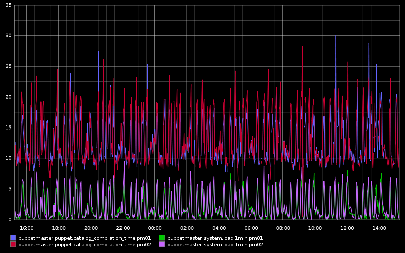

!SLIDE subsection
# puppet at mediatemple #

!SLIDE bullets incremental

# Quick history #

* 2.5 years ago: first commit
* year and a half ago: training
* last year: major systems

!SLIDE center

# Puppet related commits #

!SLIDE bullets incremental

# Puppetmaster setup #

* Apache/Passenger
* HA pair of servers using LVS
* Puppet data is managed by packages
* GlusterFS to sync puppet data

!SLIDE center

# Puppetmaster setup #

!SLIDE center

# Puppetmaster load #

!SLIDE bullets incremental

# Puppet development #

* No puppetmaster
* Puppet data installed via packages
* Puppet run done with *prun*
